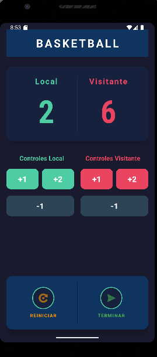
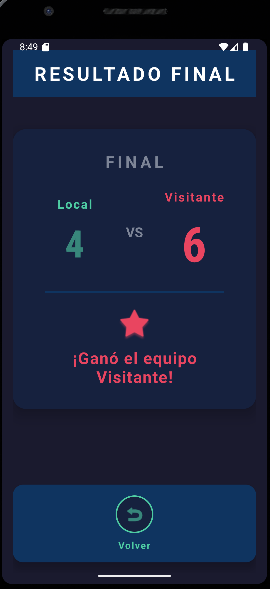

# 🏀 Basketball Score App

Aplicación Android para gestionar el marcador de un partido de baloncesto en tiempo real.

**Proyecto Final - 1er Trimestre**  
Desarrollo de Aplicaciones Móviles

---

## 📱 Descripción

Basketball Score App es una aplicación completa desarrollada en Android Studio que permite gestionar de forma intuitiva el marcador de un partido de baloncesto. La aplicación cuenta con dos pantallas principales que trabajan conjuntamente para ofrecer una experiencia profesional de seguimiento de partidos.

### Características Principales

- ✅ **Gestión dinámica de puntuación** para equipos Local y Visitante
- ✅ **Validación de marcador mínimo** (sin valores negativos)
- ✅ **Reset completo del partido** con un solo toque
- ✅ **Navegación fluida** entre pantallas
- ✅ **Persistencia de datos** al rotar el dispositivo
- ✅ **Diseño profesional** inspirado en tableros NBA
- ✅ **Interfaz responsiva** que se adapta a diferentes orientaciones

---

## 🎯 Funcionalidades

### MainActivity - Pantalla Principal

La pantalla principal permite gestionar el marcador en tiempo real con las siguientes opciones:

#### Controles de Puntuación
- **Botón +1**: Suma 1 punto al equipo
- **Botón +2**: Suma 2 puntos al equipo
- **Botón -1**: Resta 1 punto al equipo (con validación para evitar negativos)

#### Controles de Partido
- **Botón Reiniciar** (icono de reloj): Resetea ambos marcadores a 0
- **Botón Terminar** (icono de flecha): Navega a la pantalla de resultados finales

#### Características Técnicas
- Marcadores separados por colores (Verde para Local, Rojo para Visitante)
- Diseño simétrico con controles independientes para cada equipo
- Etiquetas descriptivas que identifican los controles de cada equipo
- Los datos persisten al rotar la pantalla

### ScoreActivity - Pantalla de Resultados

La segunda pantalla presenta el resultado final del partido con:

- **Marcador final** en formato visual profesional
- **Mensaje contextual** que indica:
  - "¡Ganó el equipo Local!" si Local tiene más puntos
  - "¡Ganó el equipo Visitante!" si Visitante tiene más puntos
  - "¡Empate!" si ambos equipos tienen los mismos puntos
- **Animación visual** que destaca al equipo ganador
- **Botón Volver** para regresar a la pantalla principal

---

## 🛠️ Tecnologías Implementadas

### 1. Data Binding

El proyecto utiliza **Data Binding** de forma completa, eliminando todo uso de `findViewById()`.

**Configuración en `build.gradle.kts`:**
```kotlin
android {
    buildFeatures {
        dataBinding = true
    }
}
```

**Implementación en MainActivity:**
```java
private ActivityMainBinding binding;

@Override
protected void onCreate(Bundle savedInstanceState) {
    super.onCreate(savedInstanceState);
    binding = ActivityMainBinding.inflate(getLayoutInflater());
    setContentView(binding.getRoot());
    
    // Acceso directo a las vistas
    binding.tvScoreLocal.setText(String.valueOf(scoreLocal));
    binding.btnLocalPlusOne.setOnClickListener(v -> addPointsLocal(1));
}
```

**Ventajas:**
- ✅ Mejor rendimiento (referencias generadas en tiempo de compilación)
- ✅ Seguridad de tipos (evita errores de casting)
- ✅ Código más limpio y mantenible
- ✅ Menos propenso a errores de NullPointerException

### 2. Explicit Intents y Transferencia de Datos

La navegación entre Activities se realiza mediante **Explicit Intents**, utilizando constantes para las claves de datos.

**Definición de constantes en MainActivity:**
```java
public static final String EXTRA_SCORE_LOCAL = "extra_score_local";
public static final String EXTRA_SCORE_VISITANTE = "extra_score_visitante";
```

**Envío de datos (MainActivity → ScoreActivity):**
```java
private void navigateToResults() {
    Intent intent = new Intent(this, ScoreActivity.class);
    intent.putExtra(EXTRA_SCORE_LOCAL, scoreLocal);
    intent.putExtra(EXTRA_SCORE_VISITANTE, scoreVisitante);
    startActivity(intent);
}
```

**Recepción de datos (ScoreActivity):**
```java
int scoreLocal = getIntent().getIntExtra(MainActivity.EXTRA_SCORE_LOCAL, 0);
int scoreVisitante = getIntent().getIntExtra(MainActivity.EXTRA_SCORE_VISITANTE, 0);
```

### 3. Persistencia de Estado

Implementación de `onSaveInstanceState()` para mantener los datos al rotar la pantalla.

```java
// Constantes para guardar estado
private static final String STATE_SCORE_LOCAL = "state_score_local";
private static final String STATE_SCORE_VISITANTE = "state_score_visitante";

@Override
protected void onCreate(Bundle savedInstanceState) {
    super.onCreate(savedInstanceState);
    // ...
    
    // Restaurar estado si existe
    if (savedInstanceState != null) {
        scoreLocal = savedInstanceState.getInt(STATE_SCORE_LOCAL, 0);
        scoreVisitante = savedInstanceState.getInt(STATE_SCORE_VISITANTE, 0);
    }
}

@Override
protected void onSaveInstanceState(Bundle outState) {
    super.onSaveInstanceState(outState);
    outState.putInt(STATE_SCORE_LOCAL, scoreLocal);
    outState.putInt(STATE_SCORE_VISITANTE, scoreVisitante);
}
```

### 4. Layouts Responsivos

Uso de **ConstraintLayout** para crear interfaces adaptables y eficientes.

**Características del diseño:**
- Guidelines para dividir la pantalla (50% cada equipo)
- Constraints específicos (`layout_constraintTop_toBottomOf`, `layout_constraintStart_toStartOf`, etc.)
- MaterialButton para botones con esquinas redondeadas
- CardView para elementos elevados con sombras

### 5. Gestión de Recursos

Todos los recursos están centralizados en archivos XML:

**strings.xml** - Todos los textos de la aplicación:
```xml
<string name="team_local">Local</string>
<string name="team_visitante">Visitante</string>
<string name="result_local_wins">¡Ganó el equipo Local!</string>
```

**Beneficios:**
- ✅ Facilita la internacionalización (i18n)
- ✅ Mantenimiento centralizado
- ✅ Reutilización de recursos
- ✅ Cumplimiento de buenas prácticas Android

---

## Arquitectura de la Aplicación

```
BasketballScoreApp/
│
├── MainActivity.java
│   ├── Gestión de marcadores (scoreLocal, scoreVisitante)
│   ├── Métodos de suma/resta de puntos con validación
│   ├── Reset de marcadores
│   ├── Navegación a ScoreActivity
│   └── Persistencia de estado
│
├── ScoreActivity.java
│   ├── Recepción de datos del Intent
│   ├── Cálculo del ganador
│   ├── Visualización de resultados
│   └── Animación del equipo ganador
│
├── activity_main.xml (Data Binding)
│   ├── Header con título
│   ├── CardView con marcadores
│   ├── Botones de control por equipo
│   └── Panel de controles de partido
│
└── activity_score.xml (Data Binding)
    ├── Header de resultados
    ├── CardView con marcador final
    ├── Icono de trofeo
    └── Mensaje de resultado
```

---

## Diseño Visual

### Paleta de Colores (Estilo NBA)

| Color | Código | Uso |
|-------|--------|-----|
| Azul Marino Oscuro | `#1A1A2E` | Fondo principal |
| Azul NBA | `#0F3460` | Headers y tarjetas de control |
| Verde/Turquesa | `#4ECCA3` | Equipo Local |
| Rojo | `#E94560` | Equipo Visitante |
| Gris Oscuro | `#2D4356` | Botones de resta |
| Naranja | `#FF9800` | Botón reiniciar |
| Verde Esmeralda | `#4CAF50` | Botón terminar |
| Dorado | `#FFD700` | Empate |

### Tipografía

- **Headers**: 28sp, bold, letter-spacing 0.15
- **Marcadores**: 80sp, bold, sans-serif-condensed
- **Equipos**: 20sp, bold, letter-spacing 0.1
- **Botones**: 20sp, bold
- **Controles**: 12-14sp, bold, letter-spacing 0.1

---

## Capturas de Pantalla

### MainActivity - Pantalla Principal

*Pantalla principal con marcadores y controles de puntuación*

### ScoreActivity - Resultados Finales

*Pantalla de resultados con mensaje del ganador*

---

## 🔍 Validaciones Implementadas

### 1. Validación de Puntuación Mínima
```java
private void subtractPointsLocal(int points) {
    if (scoreLocal - points >= 0) {
        scoreLocal -= points;
        updateScoreDisplay();
    }
    // Si el resultado sería negativo, no se ejecuta la resta
}
```

### 2. Validación en Transferencia de Datos
```java
// Valores por defecto en caso de datos faltantes
int scoreLocal = getIntent().getIntExtra(EXTRA_SCORE_LOCAL, 0);
int scoreVisitante = getIntent().getIntExtra(EXTRA_SCORE_VISITANTE, 0);
```

### 3. Validación de Estado
```java
// Verificación de savedInstanceState antes de restaurar
if (savedInstanceState != null) {
    scoreLocal = savedInstanceState.getInt(STATE_SCORE_LOCAL, 0);
    scoreVisitante = savedInstanceState.getInt(STATE_SCORE_VISITANTE, 0);
}
```

---

## 📋 Requisitos del Sistema

- **Android Studio**: Hedgehog (2023.1.1) o superior
- **Minimum SDK**: API 24 (Android 7.0 Nougat)
- **Target SDK**: API 36 (Android 15)
- **Compile SDK**: API 36
- **Lenguaje**: Java
- **Build System**: Gradle con Kotlin DSL

---

## 🚀 Instalación y Ejecución

### 1. Clonar el Repositorio
```bash
git clone https://github.com/tu-usuario/basketball-score-app.git
cd basketball-score-app
```

### 2. Abrir en Android Studio
- Abre Android Studio
- File → Open
- Selecciona la carpeta del proyecto
- Espera a que Gradle sincronice las dependencias

### 3. Configurar el Proyecto
- Asegúrate de tener instalado el SDK de Android API 36
- Tools → SDK Manager → Android SDK
- Marca "Android 15.0 (API 36)" si no está instalado

### 4. Ejecutar la Aplicación
- Conecta un dispositivo Android o inicia un emulador
- Click en el botón "Run" (▶️) o presiona `Shift + F10`
- Selecciona el dispositivo de destino

---

## 🧪 Casos de Prueba

### Test 1: Suma de Puntos
- ✅ Presionar +1 incrementa el marcador en 1
- ✅ Presionar +2 incrementa el marcador en 2
- ✅ Los marcadores funcionan independientemente

### Test 2: Resta de Puntos
- ✅ Presionar -1 decrementa el marcador en 1
- ✅ No permite valores negativos
- ✅ Con marcador en 0, presionar -1 no tiene efecto

### Test 3: Reset de Marcadores
- ✅ Presionar "Reiniciar" pone ambos marcadores a 0
- ✅ Funciona correctamente desde cualquier valor

### Test 4: Navegación y Resultados
- ✅ Presionar "Terminar" abre ScoreActivity
- ✅ Los marcadores se pasan correctamente
- ✅ Se muestra el mensaje correcto según el resultado:
  - Local gana: Mensaje en verde
  - Visitante gana: Mensaje en rojo
  - Empate: Mensaje en dorado

### Test 5: Persistencia
- ✅ Al rotar la pantalla, los marcadores se mantienen
- ✅ Funciona en orientación vertical y horizontal

### Test 6: Casos Límite
- ✅ Marcador 0-0: Muestra empate
- ✅ Marcadores altos (99-99): Se muestran correctamente
- ✅ Un equipo con 0 puntos: Validación correcta

---

## 📚 Buenas Prácticas Aplicadas

### ✅ Nomenclatura Clara
```java
// Variables descriptivas
private int scoreLocal;
private int scoreVisitante;

// Métodos con nombres claros
private void addPointsLocal(int points)
private void subtractPointsVisitante(int points)
private void navigateToResults()
```

### ✅ Código Comentado
```java
/**
 * Añade puntos al equipo Local
 * @param points Número de puntos a añadir
 */
private void addPointsLocal(int points) {
    scoreLocal += points;
    updateScoreDisplay();
}
```

### ✅ Uso de Constantes
```java
// Constantes para Intent extras
public static final String EXTRA_SCORE_LOCAL = "extra_score_local";

// Constantes para estado
private static final String STATE_SCORE_LOCAL = "state_score_local";
```

### ✅ Gestión de Memoria
```java
@Override
protected void onDestroy() {
    super.onDestroy();
    // Limpiar binding para evitar memory leaks
    binding = null;
}
```

### ✅ Código Limpio
- Sin código muerto
- Sin imports innecesarios
- Estructura clara y organizada
- Un método por responsabilidad

---

## 🎓 Conceptos Aprendidos

Este proyecto demuestra el dominio de los siguientes conceptos:

1. **Views y Layouts**
   - ConstraintLayout con constraints específicos
   - MaterialButton con personalización
   - CardView con elevación y sombras
   - TextView con estilos personalizados

2. **Data Binding**
   - Configuración en Gradle
   - Implementación en Activities
   - Eliminación de findViewById()
   - Inflado de layouts con binding

3. **Explicit Intents**
   - Navegación entre Activities
   - Transferencia de datos con putExtra()
   - Uso de constantes para claves
   - Recepción de datos con getIntent()

4. **Ciclo de Vida de Activities**
   - onCreate() para inicialización
   - onSaveInstanceState() para persistencia
   - onDestroy() para limpieza

5. **Gestión de Recursos**
   - strings.xml para textos
   - Drawables para botones personalizados
   - Colores en código hexadecimal
   - Organización de recursos

---

## 👨‍💻 Autor

**Tu Nombre**  
Desarrollo de Aplicaciones Móviles - 1er Trimestre

---

## 📄 Licencia

Este proyecto es un trabajo académico desarrollado como parte de la asignatura de Desarrollo de Aplicaciones Móviles.

---

## 🙏 Agradecimientos

- Material Design Guidelines
- Android Developers Documentation
- Comunidad de Stack Overflow
- Profesor/a de la asignatura

---

## 📞 Contacto

Si tienes preguntas o sugerencias sobre el proyecto:

- 📧 Email: tu.email@ejemplo.com
- 💼 LinkedIn: [Tu Perfil](https://linkedin.com/in/tu-perfil)
- 🐱 GitHub: [@tu-usuario](https://github.com/tu-usuario)

---

**⭐ Si te gusta este proyecto, dale una estrella en GitHub!**
